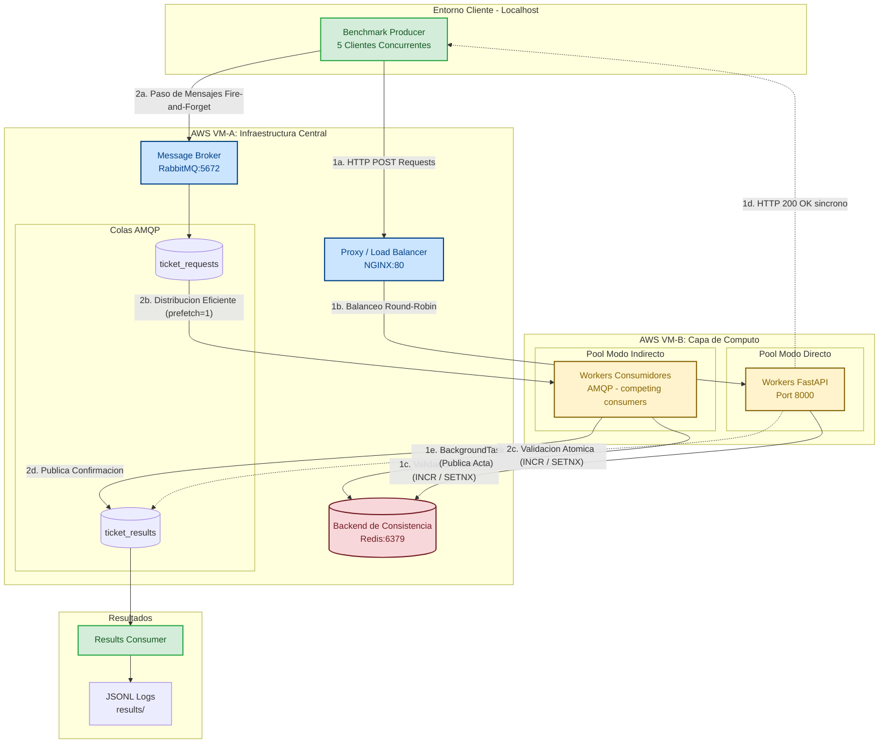

# TicketMaster — Sistema de Compra de Entradas Distribuido

Sistema distribuido de compra de entradas para conciertos (20.000 tickets) que implementa y compara dos arquitecturas de comunicación bajo alta carga y contención:

- **Modo directo (REST):** Productor → NGINX (balanceo) → Workers (FastAPI) → Redis (atomicidad)
- **Modo indirecto (cola de mensajes):** Productor → RabbitMQ → Workers → Redis

Evalúa throughput, escalabilidad y consistencia entre ambos enfoques. Proyecto académico para la asignatura de Sistemas Distribuidos.

## Tecnologías

| Tecnología | Propósito |
|---|---|
| Python 3.12 + FastAPI + Uvicorn | API REST de los workers |
| Pika (RabbitMQ) | Comunicación asíncrona (modo indirecto) |
| Redis | Backend de consistencia (contadores atómicos y cerrojos) |
| NGINX | Balanceo de carga round-robin (modo directo) |
| Docker + Docker Compose | Contenedores y orquestación |
| AWS Academy (2 VMs) | Entorno de despliegue objetivo |

## Arquitectura



### Modo Directo (REST)
```
Producer → NGINX:80 → Worker:8000 → Redis:6379
```

### Modo Indirecto (RabbitMQ)
```
Producer → RabbitMQ:5672 → Worker → Redis:6379
                                 ↓
                          Results Consumer → results/
```

Redis garantiza atomicidad mediante `INCR` (entradas sin numerar) y `SETNX` (asientos numerados).

## Estructura del proyecto

```
ticketmaster/
├── client/                          # Orquestación local: productor, consumidor y benchmarks
│   ├── b.sh                         # Script de despliegue y ejecución remota (SSH + AWS)
│   ├── docker-compose.yml           # Contenedores del cliente
│   ├── producer/                    # Driver de benchmark (REST o RabbitMQ)
│   │   ├── Dockerfile
│   │   ├── requirements.txt
│   │   └── producer.py
│   ├── results_consumer/            # Consume cola de resultados RabbitMQ → JSONL
│   │   ├── Dockerfile
│   │   ├── requirements.txt
│   │   └── consumer.py
│   ├── benchmarks/                  # Archivos de carga de trabajo
│   │   ├── benchmark_unnumbered.txt       # 20.006 peticiones (sin numerar)
│   │   ├── benchmark_numbered.txt         # 26.001 peticiones (asientos numerados, todos al asiento 42)
│   │   ├── benchmark_contention.txt       # 20.000 peticiones (alta contención, 80% a 5% de asientos)
│   │   └── benchmark_*_10.txt             # Pruebas pequeñas (10 peticiones)
│   └── results/                     # Resultados JSONL de benchmarks ejecutados
│       ├── benchmark_direct_numbered.jsonl
│       ├── benchmark_direct_unnumbered.jsonl
│       ├── benchmark_direct_contention.jsonl
│       ├── benchmark_indirect_numbered.jsonl
│       ├── benchmark_indirect_unnumbered.jsonl
│       └── results.jsonl
├── infra/                           # Stack de infraestructura (desplegado en AWS VM-A)
│   ├── docker-compose.yml           # RabbitMQ, Redis, NGINX
│   ├── nginx.conf                   # Balanceador para modo directo
│   ├── redis.conf                   # Configuración de Redis
│   └── ch_ip.sh                     # Script para actualizar IPs entre máquinas
├── worker/                          # Workers de tickets (desplegados en AWS VM-B)
│   ├── docker-compose.yml           # worker-direct y worker-indirect
│   ├── Dockerfile
│   ├── requirements.txt
│   └── worker.py                    # FastAPI + consumidor RabbitMQ
├── docs/
│   ├── deploy.txt                   # Guía de despliegue
│   └── specifications.txt           # Especificación original de la práctica
└── README.md
```

## Despliegue en AWS

Ver [docs/deploy.md](docs/deploy.md) para la guía completa de despliegue en AWS Academy.

## Uso

```bash
# Sintaxis: ./client/b.sh [direct|indirect] [numbered|unnumbered|contention] [clients] [workers]
./client/b.sh direct  unnumbered 50 1
./client/b.sh direct  numbered   50 1
./client/b.sh direct  contention 50 1
./client/b.sh indirect unnumbered 50 4
./client/b.sh indirect numbered   50 4
./client/b.sh indirect contention 50 4
```

El script:
1. Limpia contenedores viejos y escala workers en AWS vía SSH
2. Reconfigura NGINX dinámicamente (modo directo)
3. Resetea el estado del sistema (Redis)
4. Ejecuta el benchmark y recolecta resultados

## Endpoints de la API (Modo Directo)

| Endpoint | Método | Descripción |
|----------|--------|-------------|
| `/health` | GET | Health check |
| `/buy/unnumbered` | POST | Compra entrada sin numerar |
| `/buy/numbered/{seat_id}` | POST | Compra un asiento numerado específico |
| `/reset` | POST | Resetea contadores y asignaciones de asientos |

## Resultados de Benchmark

Los resultados se guardan en `client/results/benchmark_<mode>_<type>.jsonl` en formato JSONL:

```json
{"mode": "direct", "ticket_type": "unnumbered", "total_requests": 20000,
 "successful": 20000, "failed": 0, "total_time_seconds": 33.1,
 "throughput_ops_per_second": 604.5, "producers": 50, "workers": 1}
```

## Especificaciones

Ver [docs/specifications.txt](docs/specifications.txt) para los requisitos originales de la práctica.
# ticketmasterV2
